# Architecture Documentation

This document provides visual representations of the barcode_validator architecture through Mermaid diagrams.

## Class Inheritance Tree

The following diagram shows the inheritance relationships between classes in the barcode_validator codebase:

```mermaid
graph TB
    %% Validator hierarchy
    AbstractValidator["AbstractValidator<br/>(validator.py)"]
    StructuralValidator["StructuralValidator<br/>(structural.py)"]
    TaxonomicValidator["TaxonomicValidator<br/>(taxonomic.py)"]
    ProteinCodingValidator["ProteinCodingValidator<br/>(protein_coding.py)"]
    NonCodingValidator["NonCodingValidator<br/>(non_coding.py)"]
    
    AbstractValidator --> StructuralValidator
    AbstractValidator --> TaxonomicValidator
    StructuralValidator --> ProteinCodingValidator
    StructuralValidator --> NonCodingValidator
    
    %% IDService hierarchy
    IDService["IDService<br/>(idservice.py)"]
    BLAST["BLAST<br/>(blast.py)"]
    BOLD["BOLD<br/>(bold.py)"]
    BLASTDistilled["BLAST<br/>(bolddistilled.py)"]
    GalaxyBLAST["GalaxyBLAST<br/>(galaxy_blast.py)"]
    
    IDService --> BLAST
    IDService --> BOLD
    IDService --> BLASTDistilled
    IDService --> GalaxyBLAST
    
    %% TaxonResolver hierarchy
    TaxonResolver["TaxonResolver<br/>(taxonomy.py)"]
    BoldResolver["BoldResolver<br/>(bold.py)"]
    NCBIResolver["NCBIResolver<br/>(ncbi.py)"]
    BoldDistilledResolver["BoldDistilledResolver<br/>(bolddistilled.py)"]
    NSRResolver["NSRResolver<br/>(nsr.py)"]
    
    TaxonResolver --> BoldResolver
    TaxonResolver --> NCBIResolver
    TaxonResolver --> BoldDistilledResolver
    TaxonResolver --> NSRResolver
    
    %% Main orchestrator and CLI (not inheritance but main classes)
    ValidationOrchestrator["ValidationOrchestrator<br/>(orchestrator.py)"]
    BarcodeValidatorCLI["BarcodeValidatorCLI<br/>(cli.py)"]
    DNAAnalysisResultSet["DNAAnalysisResultSet<br/>(dna_analysis_result.py)"]
    DNAAnalysisResult["DNAAnalysisResult<br/>(dna_analysis_result.py)"]
    
    %% Factories (separate)
    StructureValidatorFactory["StructureValidatorFactory<br/>(validators/factory.py)"]
    IDServiceFactory["IDServiceFactory<br/>(idservices/factory.py)"]
    ResolverFactory["ResolverFactory<br/>(resolvers/factory.py)"]
    
    style AbstractValidator fill:#e1f5ff
    style IDService fill:#e1f5ff
    style TaxonResolver fill:#e1f5ff
    style ValidationOrchestrator fill:#ffe1e1
    style BarcodeValidatorCLI fill:#ffe1e1
```

### Class Hierarchy Explanation

**Validators:**
- `AbstractValidator` is the base class for all validators
- `StructuralValidator` handles structural validation (length, ambiguities)
- `TaxonomicValidator` performs reverse taxonomy validation via ID services
- `ProteinCodingValidator` extends StructuralValidator for protein-coding markers (e.g., COI-5P)
- `NonCodingValidator` extends StructuralValidator for non-coding markers (e.g., ITS)

**IDService:**
- `IDService` is the base class for identification services
- `BLAST` implements local BLAST-based identification
- `BOLD` uses the BOLD Systems identification engine
- `BLASTDistilled` uses BLAST against distilled BOLD data
- `GalaxyBLAST` uses Galaxy web service for BLAST

**TaxonResolver:**
- `TaxonResolver` is the base class for taxonomic resolution
- `BoldResolver` resolves BOLD process IDs
- `NCBIResolver` resolves NCBI taxonomy IDs
- `BoldDistilledResolver` resolves distilled BOLD taxonomy
- `NSRResolver` resolves NSR (Netherlands Species Register) identifiers

**Factories:**
- Factory classes create appropriate instances based on configuration

## Process Flow During Validation

The following diagram shows how components interact during a typical validation run:

```mermaid
flowchart TD
    Start([User runs CLI]) --> CLI[BarcodeValidatorCLI]
    CLI --> ParseArgs[Parse command line arguments]
    ParseArgs --> LoadConfig[Load configuration]
    LoadConfig --> CreateOrch[Create ValidationOrchestrator]
    
    CreateOrch --> ValidateFile[validate_file]
    ValidateFile --> DetermineMode{Determine validation mode}
    
    DetermineMode --> InitOrch[Initialize orchestrator]
    InitOrch --> InitMode{Check mode}
    
    InitMode -->|structural or both| InitStruct[initialize_structural_validator]
    InitMode -->|taxonomic or both| InitTaxon[initialize_taxonomic_validator]
    
    InitStruct --> CreateSV[Create StructuralValidator via Factory]
    CreateSV --> SetupHMM{Needs HMM?}
    SetupHMM -->|Yes| LoadHMM[Load HMM profiles]
    SetupHMM -->|No| SetupSVResolver{Needs Resolver?}
    LoadHMM --> SetupSVResolver
    SetupSVResolver -->|Yes| CreateInputResolver[Create input TaxonResolver]
    SetupSVResolver -->|No| SVReady[Structural validator ready]
    CreateInputResolver --> SVReady
    
    InitTaxon --> CreateTV[Create TaxonomicValidator]
    CreateTV --> SetupTVResolver{Needs Resolver?}
    SetupTVResolver -->|Yes| CreateInputResolver2[Create input TaxonResolver]
    SetupTVResolver -->|No| TVReady[Taxonomic validator ready]
    CreateInputResolver2 --> SetupID{Needs IDService?}
    SetupID -->|Yes| CreateIDService[Create IDService via Factory]
    SetupID -->|No| TVReady
    CreateIDService --> IDType{IDService type}
    IDType -->|BLAST/distilled| SetupBLAST[Setup BLASTN]
    IDType -->|needs resolver| CreateRefResolver[Create reference TaxonResolver]
    IDType -->|BOLD/Galaxy| IDReady[IDService ready]
    SetupBLAST --> CreateRefResolver
    CreateRefResolver --> IDReady
    IDReady --> TVReady
    
    SVReady --> ParseInput[Parse input file FASTA/TSV]
    TVReady --> ParseInput
    
    ParseInput --> CreateResultSet[Create DNAAnalysisResultSet]
    CreateResultSet --> PopulateRS[Populate result set with records]
    PopulateRS --> Validate[validate]
    
    Validate --> DoStruct{Structural<br/>validator exists?}
    DoStruct -->|Yes| RunStruct[Run structural validation]
    DoStruct -->|No| DoTax
    
    RunStruct --> IterateRecords[Iterate over records]
    IterateRecords --> CheckMarker[Check marker type]
    CheckMarker --> ValidateLength[Validate sequence length]
    ValidateLength --> ValidateAmbig[Validate ambiguities]
    ValidateAmbig --> MarkerSpecific[Validate marker-specific criteria]
    MarkerSpecific -->|Protein coding| CheckStopCodons[Check stop codons<br/>Calculate translation]
    MarkerSpecific -->|Non-coding| CalcGC[Calculate GC content]
    CheckStopCodons --> NextRecord{More records?}
    CalcGC --> NextRecord
    NextRecord -->|Yes| IterateRecords
    NextRecord -->|No| DoTax
    
    DoTax{Taxonomic<br/>validator exists?}
    DoTax -->|Yes| RunTax[Run taxonomic validation]
    DoTax -->|No| MergeData
    
    RunTax --> EnrichResults[Enrich results with taxonomy]
    EnrichResults --> BatchRecords[Batch structurally valid records]
    BatchRecords --> RunIDService[Run IDService on batch]
    RunIDService --> IDServiceType{IDService type}
    IDServiceType -->|BLAST| RunLocalBLAST[Run local BLAST]
    IDServiceType -->|Galaxy| CallGalaxy[Call Galaxy API]
    IDServiceType -->|BOLD| CallBOLD[Call BOLD API]
    RunLocalBLAST --> ParseBLAST[Parse BLAST results]
    ParseBLAST --> CollectTaxa[Collect higher taxa]
    CallGalaxy --> CollectTaxa
    CallBOLD --> CollectTaxa
    CollectTaxa --> CompareTaxa[Compare observed vs expected taxa]
    CompareTaxa --> UpdateResults[Update result objects]
    UpdateResults --> MergeData
    
    MergeData[Add CSV/YAML data to results]
    MergeData --> WriteResults[write_results]
    WriteResults --> Triage[Triage results by mode]
    Triage --> OutputFASTA[Write valid sequences to FASTA]
    Triage --> OutputTSV[Write all results to TSV]
    OutputFASTA --> End([Validation complete])
    OutputTSV --> End
    
    style CLI fill:#ffe1e1
    style ValidationOrchestrator fill:#ffe1e1
    style CreateSV fill:#e1f5ff
    style CreateTV fill:#e1f5ff
    style CreateIDService fill:#e1f5ff
    style CreateInputResolver fill:#e1f5ff
    style CreateRefResolver fill:#e1f5ff
    style RunStruct fill:#e1ffe1
    style RunTax fill:#e1ffe1
    style Start fill:#fff3e1
    style End fill:#fff3e1
```

### Process Flow Explanation

The validation process follows these main phases:

1. **Initialization (CLI → Orchestrator)**
   - User invokes the CLI
   - Arguments are parsed and configuration is loaded
   - ValidationOrchestrator is created

2. **Validator Setup**
   - Based on mode (structural/taxonomic/both), appropriate validators are initialized
   - Structural validator may need HMM profiles for alignment
   - Taxonomic validator needs an IDService and TaxonResolvers
   - IDServices may need BLASTN setup and reference taxonomies

3. **Input Processing**
   - Input file is parsed (FASTA or TSV format)
   - DNAAnalysisResultSet is created and populated with sequence records

4. **Structural Validation** (if enabled)
   - Each record is checked for:
     - Correct marker type
     - Sequence length requirements
     - Ambiguous bases
     - Marker-specific criteria (stop codons for protein-coding, GC content for non-coding)
   - Results are recorded in DNAAnalysisResult objects

5. **Taxonomic Validation** (if enabled)
   - Results are enriched with expected taxonomy from input resolver
   - Structurally valid records are batched
   - IDService performs identification (via BLAST, BOLD, or Galaxy)
   - Observed taxa are compared against expected taxa
   - Validation outcomes are recorded

6. **Output Generation**
   - Additional data from CSV/YAML files is merged
   - Results are triaged based on validation mode
   - Valid sequences are written to FASTA
   - All results are written to TSV with detailed validation metrics

The architecture uses dependency injection and factory patterns to allow flexible configuration of different validation strategies, identification services, and taxonomic backbones.
