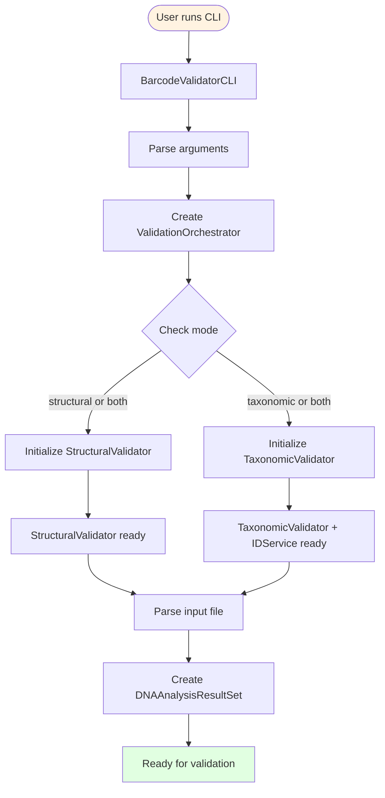

# Architecture Documentation

This document provides visual representations of the barcode_validator architecture through Mermaid diagrams. The diagrams are organized into modular components suitable for manuscript publication.

## Class Inheritance Hierarchies

### Figure 1: Validator Class Hierarchy

The validator hierarchy implements a Strategy pattern where `AbstractValidator` defines the interface for sequence validation. `StructuralValidator` validates sequence quality (length, ambiguities, marker-specific features), while `TaxonomicValidator` performs reverse taxonomy via identification services. Concrete validators (`ProteinCodingValidator`, `NonCodingValidator`) implement marker-specific validation logic.

### Figure 2: IDService Class Hierarchy

The IDService hierarchy provides pluggable identification backends. `BLAST` uses local NCBI BLAST+ searches, `BOLD` queries the BOLD Systems identification engine, and `GalaxyBLAST` uses the Galaxy web service for distributed BLAST searches.

### Figure 3: TaxonResolver Class Hierarchy

The TaxonResolver hierarchy handles taxonomic name resolution across different taxonomic backbones. `BoldResolver` parses BOLD process IDs, `NCBIResolver` works with NCBI taxonomy IDs, and `NSRResolver` handles Netherlands Species Register identifiers.

## Validation Process Flow

### Figure 4: Initialization and Setup Phase

The initialization phase parses command-line arguments, creates the orchestrator, and initializes validators based on the selected mode (structural, taxonomic, or both). The orchestrator uses factory patterns to instantiate appropriate validator implementations and supporting services (IDService, TaxonResolver, BLASTN, HMM profiles).

### Figure 5: Structural Validation Phase

Structural validation examines sequence quality without external database queries. Each sequence is checked for correct length, ambiguous base content, and marker-specific features. Protein-coding sequences are translated to detect premature stop codons, while non-coding sequences have their GC content calculated.

### Figure 6: Taxonomic Validation Phase

Taxonomic validation uses reverse taxonomy to verify specimen identifications. Sequences are enriched with expected taxonomy from the input resolver, then batched by taxonomic constraint for efficient identification. The selected IDService performs searches and returns observed taxa, which are compared against expected taxa to validate the original identification.

